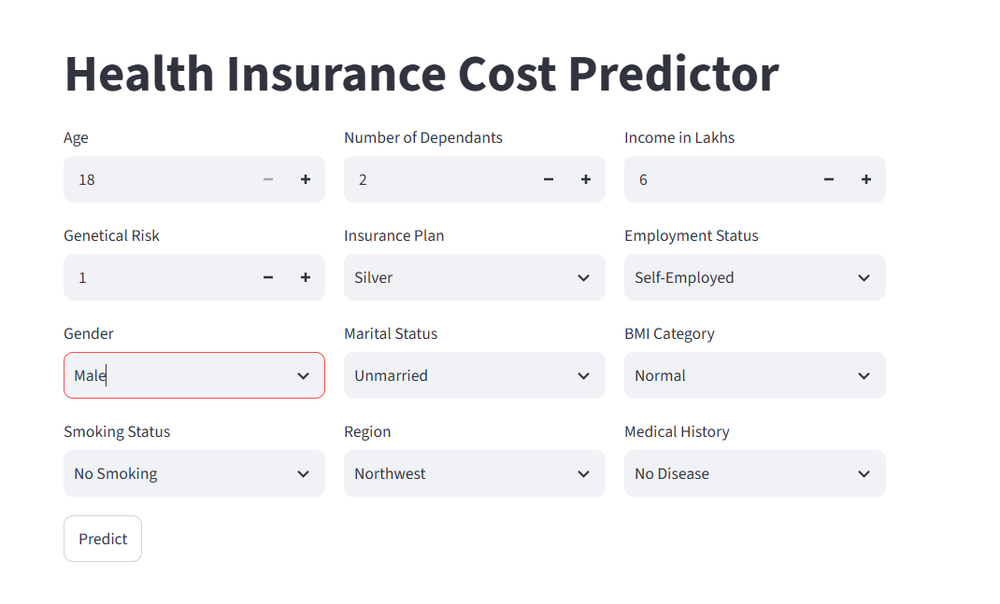
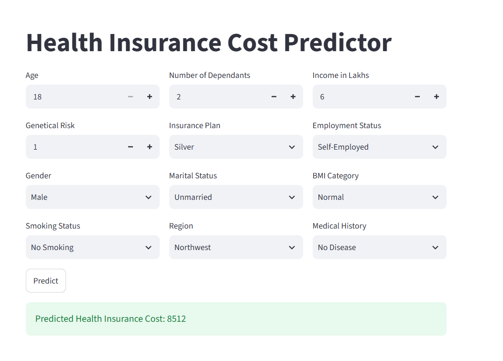

# 🏥 Healthcare Premium Prediction

A Machine Learning web application that predicts an individual's **annual health insurance premium** based on demographic, lifestyle, and medical information.

Built using **Python**, **Scikit-learn**, **XGBoost**, and **Streamlit**.

---

## 🚀 Live Demo

👉 **Try the application here:**

**https://siddangi-ml-project-premium-prediction.streamlit.app/**

---

## ✨ Features

- Predict annual healthcare insurance premiums
- Interactive Streamlit web application
- Data preprocessing and feature engineering pipeline
- Machine learning-based premium prediction
- Fast and user-friendly interface
- Real-time predictions

---

## 🛠 Tech Stack

| Category | Technologies |
|----------|--------------|
| Language | Python |
| Data Analysis | Pandas, NumPy |
| Machine Learning | Scikit-learn, XGBoost |
| Visualization | Matplotlib, Seaborn |
| Web Framework | Streamlit |
| Version Control | Git, GitHub |

---

## 📂 Project Structure

```text
ML_Project_Premium_Healthcare/
│
├── artifacts/                  # Trained models and scaler objects
├── main.py                     # Streamlit application
├── prediction_helper.py        # Prediction & preprocessing logic
├── requirements.txt
├── README.md
└── LICENSE
```

---

## ⚙️ Project Workflow

1. Data Cleaning
2. Feature Engineering
3. Exploratory Data Analysis (EDA)
4. Model Training
5. Model Evaluation
6. Model Serialization
7. Streamlit Deployment

---

## 📊 Input Features

The prediction model considers the following user inputs:

- Age
- Gender
- Annual Income
- Number of Dependents
- BMI Category
- Smoking Status
- Medical History
- Employment Status
- Marital Status
- Region
- Insurance Plan
- Genetical Risk

---

## ▶️ Getting Started

### Clone the repository

```bash
git clone https://github.com/siddharth-d11/ML_Project_Premium_Healthcare.git
```

### Navigate to the project folder

```bash
cd ML_Project_Premium_Healthcare
```

### Install the required packages

```bash
pip install -r requirements.txt
```

### Run the Streamlit application

```bash
streamlit run main.py
```

---

## 📸 Application Preview

<h2>📸 Application Preview</h2>

<p align="center">
  
  
</p>

## 🔮 Future Improvements

- Improve model performance through hyperparameter tuning
- Add model explainability using SHAP
- Support batch predictions
- Add interactive visualizations
- Build a REST API for predictions
- Deploy using Docker

---

## ⚠️ Disclaimer

This project was developed for **learning and educational purposes**. The predicted insurance premium is generated by a machine learning model and should **not** be considered an official insurance quotation.

---

## 👨‍💻 Author

**Siddharth Dangi**

- GitHub: https://github.com/siddharth-d11
- LinkedIn: https://www.linkedin.com/in/siddharth-dangi

---

## 📄 License

This project is licensed under the **Apache 2.0 License**. See the `LICENSE` file for more details.
